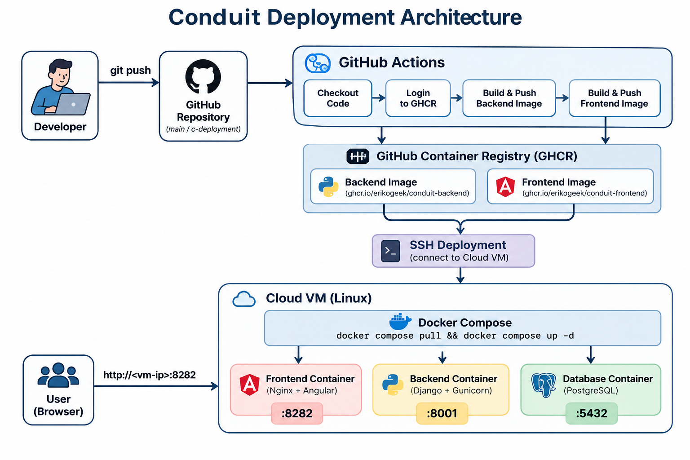

# Conduit-Deployment
This project focuses on deploying a full-stack web application consisting of a `Django backend` and an `Angular frontend` using a `GitHub Actions workflow`.

This is an extension of the previous `Conduit-Container`project.

The deployment process is automated through a CI/CD pipeline. GitHub Actions builds the `backend and frontend Docker images` and pushes them to the GitHub Container Registry (GHCR). The images are then deployed to a target cloud VM via SSH and started using Docker Compose. 

The cloud VM does not build the application images and does not require the Git repository or application source code. It only needs the `docker-compose.yaml` file and the `.env configuration` file.

The project demonstrates an automated and reproducible deployment process for a containerized full-stack application.
## Table of contents
- [1. Prerequisites](#Prerequisites)
- [2. project architecture](#project-architecture)
- [3. Quickstart](#2-Quickstart)
- [4. Usage](#Usage)
- [5. Deployment](#Deployment)

## 1. Prerequisites
To successfully set up and deploy this project, knowledge of the following technologies and software is recommended:
* Docker and Docker compose for building and managing the containers.
* Github and Github actions.
* A cloud VM 
* SSH access to the cloud VM.

For local development and testing, `Docker Desktop` is recommanded.
## 2. Project architecture
The application uses the following CI/CD deployment flow:

The developer changes the code, creates commits and pushes the changes to the repository. GitHub Actions is triggered automatically and then builds the angular frontend and django backend images. The both images are pushed to the GitHub Container Register (GHCR). The Github actions connects to the cloud VM via SSH. The `docker-compose.yaml` file is copied to the cloud VM and the `.env` file is created automatically from the Github `DOTENV`secrets. The cloud VM logs in to GHCR and pulls the latest application images using Docker Compose,that starts or updates the application containers.

>[!**Note**]:
> The cloud VM does not contain the application source code and does not use Git. The server only contains the required files (.env and docker-compose.yaml) to run the application:



The Docker images are built by GitHub Actions. The cloud VM only pulls the already-built images from GitHub Container Registry (GHCR).


## 3. Quickstart

* Clone the repository and change into the project directory:
```bash
git clone <REPOSITORY_URL>
`cd Conduit-Deployment`
```
* Create the environment file

Create `.env` based on `.env.example`and set the required variable values.

```bash
Copy-Item .env.example .env
```
The `.env` file contains configuration for the Docker images, ports, Django application, and PostgreSQL database.

* Building the containers:
```bash
cd /Conduit-Deployment/Frontend
docker buildx build --tag ghcr.io/<GITHUB_USERNAME>/conduit-frontend:latest .
```
```bash
cd /Conduit-Deployment/Backend
docker buildx build --tag ghcr.io/<GITHUB_USERNAME>/conduit-frontend:latest .
```
* Start manually and check the application:
```bash
docker compose up -d
docker compose ps
```
* CI/CD deployment

After changes are pushed in the `c-deployment`branch, the GitHub Actions workflow starts automatically.

Open the application in your browser:
| **local deployment** | **CI/CD deployment** |
| ---------------- | ---------------- |
| `http://localhost:8282` | `http://SERVER_IP:8282` |
 

## 4. Usage
After cloning the repository and create the `env.example` 
* Configure the `.env.example` file.

The configuration of env.example looks like:
| **variables** | **values** |
| --------- | --------- |
|POSTGRES_DB|Name of the postgreSQL database|
|POSTGRES_USER|postgreSQL database user|
|POSTGRES_PASSWORD|postgreSQLdatabase password|
|POSTGRES_PORT|postgreSQL port|
|DJANGO_SECRET_KEY|secret key used by django|
|DJANGO_DEBUG|enables or disables django debug mode|
|DJANGO_ALLOWED_HOSTS|hosts that django accepts|
|FRONTEND_PORT|Host port for the frontend|
|BACKEND_PORT|Host port for the backend|

Example image configuration:
| **variables** | **values** |
| --------- | --------- |
|POSTGRES_DB|conduit|
|DJANGO_SECRET_KEY|-7!x2@q9#Lm4$Pz8&vK1^sN6*Rt3jgafr|
|BACKEND_PORT|8083|

* Configure the `repository variables`

The GitHub Actions workflow uses the following repository variables:

| **variables** | **values** |
| --------- | --------- |
| BACKEND_IMAGE | ghcr.io/<github_username>/conduit-backend |
| FRONTEND_IMAGE | ghcr.io/<github_username>/conduit-frontend |
| IMAGE_TAG | latest |
The workflow uses these variables instead of hardcoding the image names.

For example:

`${{ vars.BACKEND_IMAGE }}:${{ vars.IMAGE_TAG }}`

The workflow also creates an additional image tag using the Git commit SHA:

`${{ vars.BACKEND_IMAGE }}:${{ github.sha }}`

This makes each built image identifiable by the commit that created it.

|**repository secrets**|**meaning**|
| --------- | --------- |
| SSH_PRIVATE_KEY_B64| private deployment-key |
| SSH_HOST | Server-Adresse |
| SSH_USER | Server-username |
| DOTENV | Complete environment configuration written to .env on the server |
| GHCR_USERNAME | GitHub username used for GHCR authentication|
| GHCR_TOKEN |GitHub token used by the server to pull private images from GHCR |

These values are configured under:

`GitHub --> Repository --> Settings --> Secrets and variables --> Actions --> GitHub Repository Secrets`


* Git workflow

After making changes, commit and push them to the deployment branch:
 ```bash
git add <FILE_NAME>
```
```bash
git commit -m "<commit message>"
```
```bash
git push origin feature/c-deployment
```
A push to `c-deployment` automatically triggers the GitHub Actions workflow.
* Local docker image build

The Dockerfiles can also be tested locally.
```bash
docker buildx build --tag <FRONTEND_IMAGE>:<IMAGE_TAG > .
docker buildx build --tag ghcr.io/erikogeek/conduit-backend:latest .
docker build --tag conduit-frontend .
docker build --tag conduit-backend .
```
The `.` at the end specifies the current directory as the Docker build context.
`Buildx` is used because the github actions workflow uses `Docker Buildx`.
| **elements** | **meaning** |
| -------- | ------ |
| ghcr.io | github container registry |
| <GITHUB_USERNAME> | github username of organization |
| conduit-frontend | docker image name |
| latest | docker image tag |
| `.`| the docker build context |

## 5. Deployment

 The deployment workflow uses the file named `deployment.yaml` located at `.github/workflows/deployment.yaml`. 
 
 The workflow contains two jobs:
* Build

The `build`job performs the following steps:

| **step** | **activity** |
| -------- | ------------ |
| 1. | check out the repository |
| 2. | Logs in to GitHub Container Registry|
| 3. | Builds the Django backend Docker image|
| 4. | Pushes the backend image to GHCR|
| 5. | Builds the Angular frontend Docker image.|
| 6. | Pushes the frontend image to GHCR. |

The images receive two tags:

`ghcr.io/<GITHUB_USERNAME>/conduit-frontend:latest`

`ghcr.io/<GITHUB_USERNAME>/conduit-backend:latest`

And additional commit-based tag:

`ghcr.io/<GITHUB_USERNAME>/conduit-backend:<COMMIT_SHA> `

`ghcr.io/<GITHUB_USERNAME>/conduit-frontend:<COMMIT_SHA>`


* Deploy job

The `deploy` job starts only after the `build` job has completed successfully. This is defined by:

`needs: build`

The deployment performs the following steps:

| ` step` | ` activity` |
| -------- | ------ |
| 1. | Creates the SSH key from the configured GitHub secret |
| 2. | Decodes the Base64-encoded SSH private key |
| 3. | Copies docker-compose.yaml to the cloud VM |
| 4. | Creates the `.env file` from the `GitHub DOTENV secret` |
| 5. | Logs in to GHCR on the cloud VM |
| 6. | Pulls the Docker images from GHCR |
| 7. | Starts the application with Docker Compose |

The deployment commands executed on the cloud VM are:

```bash
cd ~/Conduit-Deployment
docker login ghcr.io
docker compose pull
docker compose up -d
```
The `.env file` is automatically created by the GitHub Actions workflow. The deployment does not use `git pull` on the cloud VM. 

The cloud VM does not need the `Git repository`, `the backend source code`, or the `frontend source code`.

After deployment, the frontend is available on `port 8282` of the host system. Use: `http://<VM-IP>:8282`

The resulting setup provides and automated, reproducible and containerized CI/CD deployment process for the Conduit full-stack application.